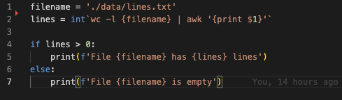

# Pysh Syntax Highlighter

## Features

The official Python Shell (pysh) syntax highlighting for Visual Studio Code.

## Requirements

The extension itself does not have any requirements, but you will need `pysh` installed to actually transpile and run your Pysh code. Instructions are on the [Pysh GitHub repo](https://github.com/yrahul3910/pysh/tree/master/pysh).

## Extension Settings

There are no configuration options for this extension yet. In the future, they will be added to `contributes.configuration`.

## Known Issues

As of now, commands inside the Shell script are not highlighted.

## Release Notes

### 1.0.0

Initial release of Pysh syntax highlighting.
